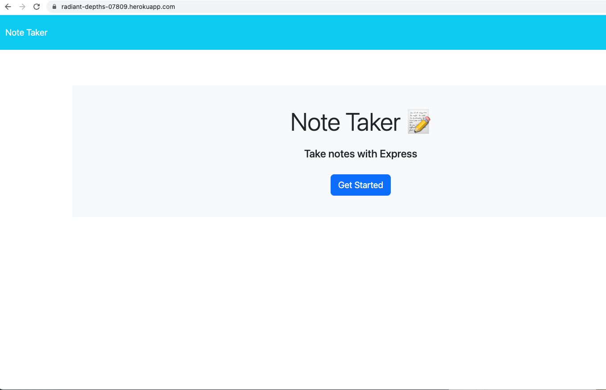
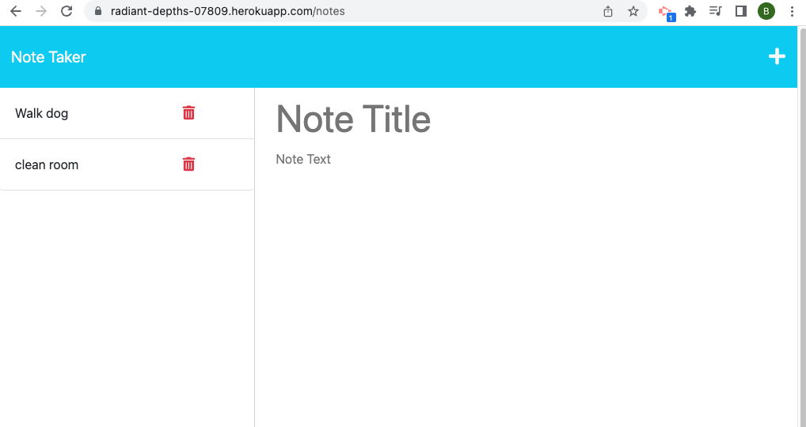
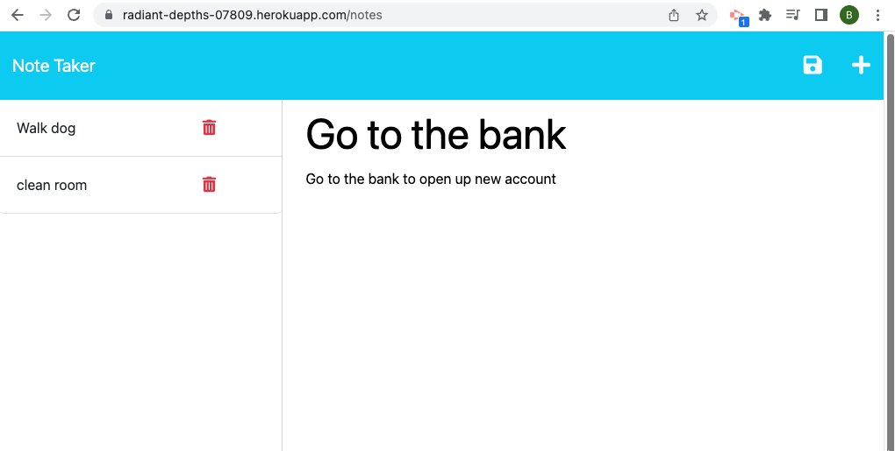
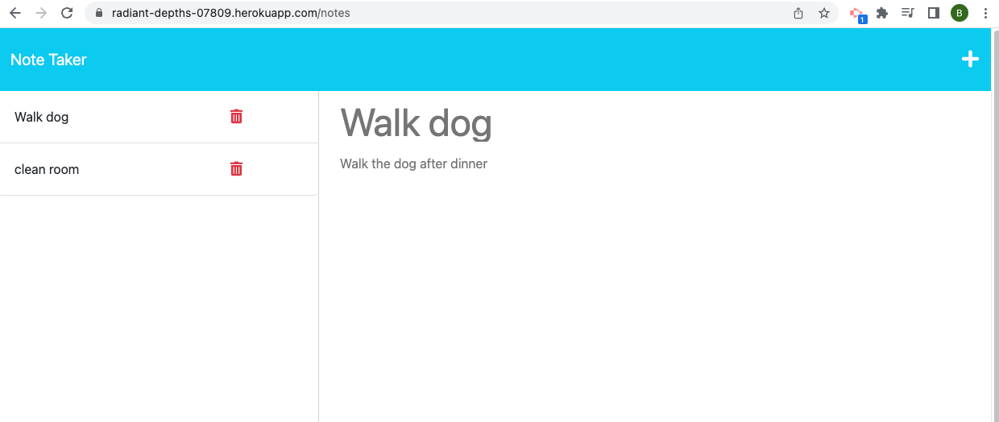

# Note Taker

## Description

In this project, I created the server.js file in order to handle the routing of requests. The file uses GET, POST, and DELETE requests in order to make the app run. I learned more about requests, about persisting data in another way instead of local storage, and finally hosting on Heroku.

This app will take user input to store their notes to be read and accessed at a later date, as well as delete them if they so choose.


## Installation
  
  ```
  npm i
  ```
 

## Usage

To use this app, follow this link [Note Taker App](https://radiant-depths-07809.herokuapp.com/).

OR alternatively to run this locally in the console, type 
```
npm start
```

and then navigate to [local host port 3001 ](http://localhost:3001/)

When you load the website you will arrive at the landing page. Click the  "Get Started" button to load the previous notes that have been entered, to enter new notes or remove any old notes. To add a new note, click on the "+" button in the top right, enter the note title and the text then click on the "Save" icon. To delete any notes, simply click on the trash can. 

Example screenshots are below





